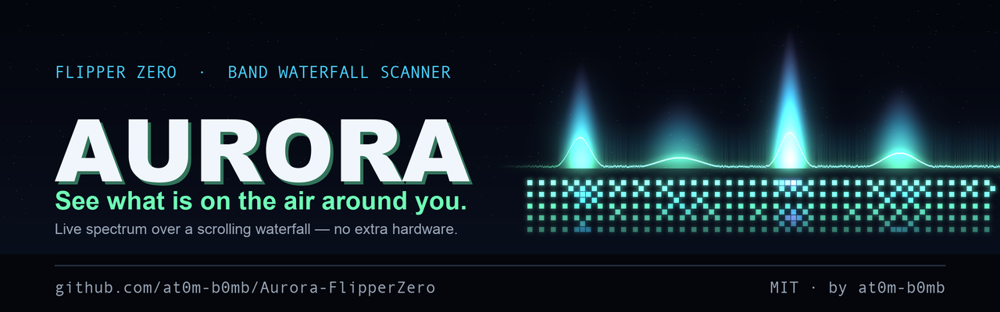
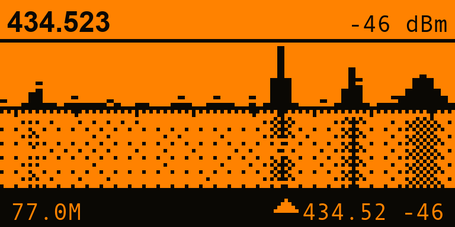
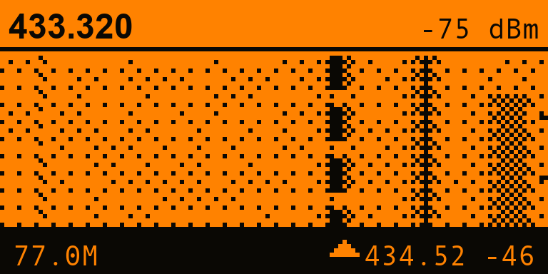
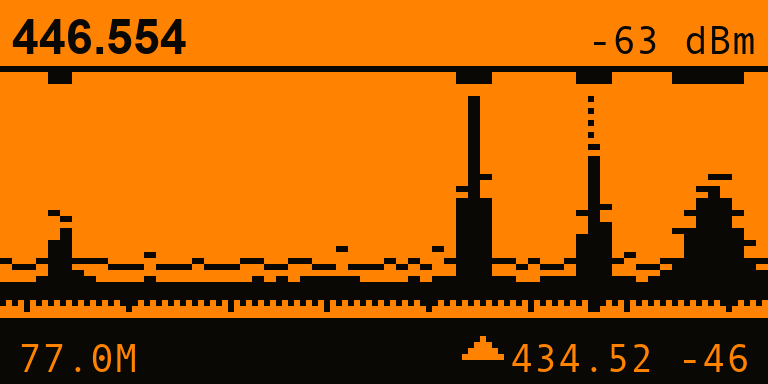
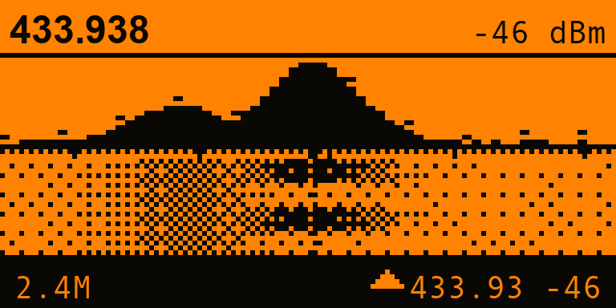
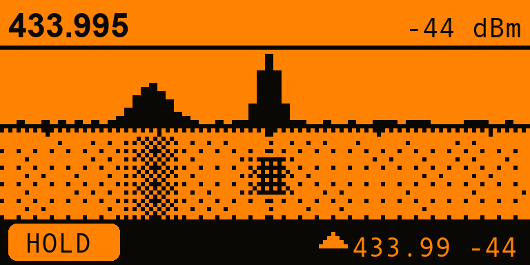
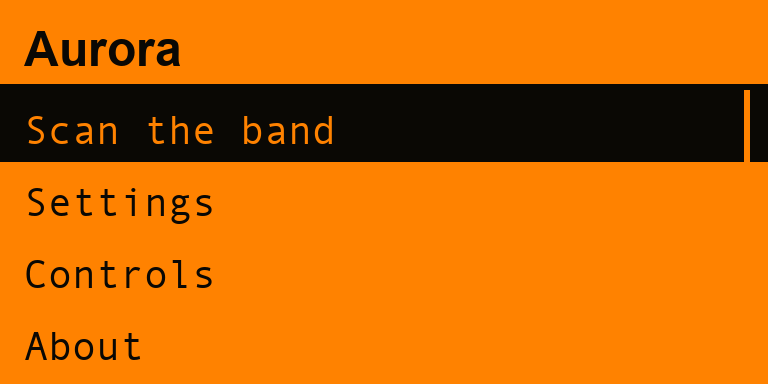
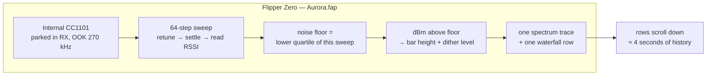
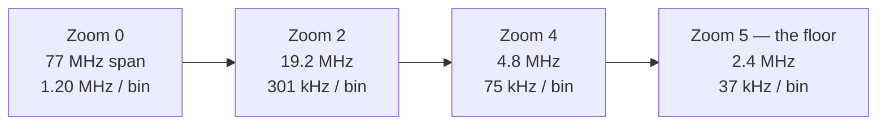

<!-- banner -->
<p align="center">
  
</p>

<h1 align="center">Aurora 🌌</h1>
<p align="center"><i>See what is on the air around you.</i></p>

<p align="center">
  
  
  
  
  
</p>

<p align="center">
  Your Flipper can already <b>hear</b> Sub-GHz. It just never <b>shows</b> you the band.
  <b>Aurora</b> walks the internal CC1101 across a whole ISM band sixty-four steps at a time and
  paints what it hears: a <b>live spectrum</b> over a <b>scrolling waterfall</b>, so a burst that
  lasted a tenth of a second is still on screen seconds later — and you can put a cursor on it and
  read its <b>frequency and strength</b>.
</p>

<p align="center"><sub>Not "is something transmitting?" — <b>what</b>, <b>where</b> in the band, <b>how strong</b>, and <b>how often</b>.</sub></p>

---

## 📟 On the Flipper

<p align="center">
  
  &nbsp;
  
  &nbsp;
  
</p>
<p align="center">
  
  &nbsp;
  
  &nbsp;
  
</p>
<p align="center">
  <sub><b>Split</b> — spectrum + waterfall &nbsp;·&nbsp; <b>Waterfall</b> — full height &nbsp;·&nbsp;
  <b>Spectrum</b> — full height + activity map &nbsp;·&nbsp; <b>Zoomed</b> onto one carrier &nbsp;·&nbsp;
  <b>HOLD</b> &nbsp;·&nbsp; <b>Menu</b></sub>
</p>

---

## ✨ Features

- 🌊 **A real waterfall.** Every sweep adds a row, and rows scroll away beneath the live trace. A
  remote that keys for 100 ms leaves a mark you can still read four seconds later — the thing a
  bar-graph RSSI meter physically cannot show you.
- 🎚️ **Sixteen shades on a one-bit screen.** Signal strength is rendered with an ordered **Bayer
  dither**, so the waterfall reads as *brightness* rather than a binary on/off smear.
- 🔍 **Zoom that follows your cursor.** Start on the whole **387–464 MHz** band, park the cursor on a
  peak, and press Up four times. Each step halves the span **around the cursor**, so you walk the
  signal down to a 2.4 MHz window without ever losing it.
- 📍 **A cursor that answers the question.** Frequency in **MHz** and level in **dBm**, live, for any
  bin. Push past the edge of a zoomed window and the window pans.
- 🎯 **Hold OK to snap to the strongest signal.** One button, from anywhere in the band, straight
  onto whatever is loudest.
- 🧊 **Freeze the display.** Hold Back and the waterfall stops scrolling, so you can study a burst
  that has already ended instead of watching it slide off the bottom.
- 🧮 **A noise floor that measures itself.** The floor is the **lower quartile of each sweep's own
  64 readings** — so the display calibrates to wherever you are standing, and a handful of loud
  carriers cannot drag it the way they would drag an average.
- 🗺️ **An activity map.** Spectrum view marks every bin that has been busy since you tuned there, so
  you can leave it sitting and come back to a summary of the band.
- 🔌 **Zero extra hardware.** Onboard CC1101. Nothing to flash, nothing to wire.
- 🕶️ **Listen-only.** Aurora tunes and measures. It **never transmits**.

---

## 🧠 How it works

A spectrum analyser you can afford to build out of one narrowband receiver is a **sweeper**: it
cannot listen to the whole band at once, so it listens to a sliver of it very fast, over and over.



Sixty-four stops is a deliberate number: it is **two pixels per bin** across a 128-pixel screen, so
a bin is never blurred across a fractional column. At **Normal** detail a sweep takes about 70 ms,
which is roughly **14 rows of waterfall per second**.

### The noise floor is the interesting part

Most RSSI tools pick a constant for "quiet" and hope. Aurora doesn't have to: a sweep already
contains 64 samples of the band, and in almost any real band **most of it is empty**. Taking the
lower quartile of those 64 readings gives a floor that is measured, not assumed.

> That is why the display looks the same in a quiet field and in a noisy apartment block, and why
> six loud carriers do not wash the picture out. It also gives Aurora an honest definition of
> "something is transmitting here": **12 dB above the measured floor**.

### What zoom does and does not buy you



The CC1101's receive filter is **270–650 kHz wide**. Once the bins are narrower than that, a single
carrier necessarily smears across several of them — you can see exactly that in the zoomed
screenshot above, where one transmitter is a seven-bin hump rather than a spike.

> So zooming buys **pointing accuracy**, not true resolution, and Aurora **stops at 2 MHz** instead
> of offering finer columns that would imply a precision the radio does not have.

---

## 🚀 Install

No devboard, no firmware to flash — it's a single `.fap`.

**Option A — prebuilt `.fap` (easiest)**

1. Grab `aurora.fap` from the [**Releases**](https://github.com/at0m-b0mb/Aurora-FlipperZero/releases) page.
2. Open **qFlipper**, drag the file onto `SD Card / apps / Sub-GHz /`.
3. On the Flipper: **Apps → Sub-GHz → Aurora**.

**Option B — build it yourself with [`ufbt`](https://github.com/flipperdevices/flipperzero-ufbt)**

```bash
# one-time
python3 -m pip install --upgrade ufbt

# from the repo root, with your Flipper plugged in over USB:
ufbt            # build aurora.fap into ./dist
ufbt launch     # build, upload to the Flipper and open it
```

```bash
make -C test    # run the scale-engine unit tests on your machine
```

> Icons in `icons/`, screenshots and the banner in `images/` are generated — regenerate with
> `python3 tools_gen_icons.py`, `python3 tools_gen_mockups.py` and `python3 tools_gen_banner.py` (needs `pillow`).

---

## 🎮 Using it

### Controls

| Key | Action |
| --- | --- |
| **← / →** | Move the cursor one bin. **Hold** to scrub; push past an edge and the window pans. |
| **↑ / ↓** | Zoom in / out, centred **on the cursor**. |
| **OK** | Cycle the view: **Split → Waterfall → Spectrum**. |
| **OK (hold)** | Snap the cursor onto the **strongest bin** in the sweep. |
| **Back (hold)** | **Freeze** the display. Hold again to resume. |
| **Back** | Leave the scanner. |

The app shows a control legend for the first couple of seconds each time you open the scanner, and
there's a full **Controls** page in the menu.

### Finding something, start to finish

1. **Scan the band.** You land on the whole of **387–464 MHz**, the busiest ISM range in most of the
   world. (Change it in **Settings → Band**: `300-348` for 315 MHz gear, `779-928` for 868/915.)
2. **Press a remote.** A column lights up in the spectrum and starts painting a stripe down the
   waterfall.
3. **Hold OK.** The cursor jumps to it. Read the header: frequency and dBm.
4. **Press Up a few times.** Each step halves the span around the cursor. By 2.4 MHz you're looking
   at one channel.
5. **Hold Back** to freeze if the burst was short and you want to study it.

### Reading the display

| What you see | What it means |
| --- | --- |
| Header, left | Cursor frequency, MHz |
| Header, right | Level in that bin, dBm |
| Filled bars | The live sweep |
| Thin caps above the bars | **Peak trace** (Settings → Peak trace) |
| Dotted row under the bars | Round-frequency gridlines |
| Solid block on the axis | Cursor |
| Strip, left | Current span — or **HOLD** when frozen |
| Strip, right | ▲ Loudest bin right now, MHz and dBm |
| Band under the header rule *(Spectrum view)* | **Activity map** — every bin that has been busy since you tuned here |
| Notches on the right edge *(Waterfall view)* | One-second time ticks, from the **measured** sweep rate |

### Settings

| Setting | Options | Notes |
| --- | --- | --- |
| **Band** | `300-348` · `387-464` · `779-928` | The three ranges the firmware permits |
| **Detail** | Fast · Normal · Fine | Dwell per bin. Fine is slower but a much steadier trace |
| **Range** | 30 · 50 · 70 dB | Display contrast: how many dB fill the scale |
| **Peak trace** | Off · Decay · Hold | Decay fades back to live; Hold never forgets |
| **Chirp on hit** | ON / OFF | A short chirp when a quiet channel comes alive |
| **LED** | ON / OFF | Green blink on the same event |

---

## 🔬 Honest limitations

- **It sweeps; it does not watch.** Aurora listens to one bin at a time. A burst shorter than a
  sweep (~70 ms at Normal) can be **missed entirely**, or land in one bin only. If you need
  *nothing gets past me* on one frequency, that is a different instrument — see
  **[Cerberus](https://github.com/at0m-b0mb/flipper-cerberus)** below.
- **Zoom is pointing accuracy, not resolution.** The receive filter is 270–650 kHz wide, so a
  carrier smears across several bins however far you zoom. Aurora stops at 2 MHz rather than imply
  otherwise.
- **dBm is the chip's own RSSI, uncalibrated.** Compare readings to each other, not to a spec sheet.
  Antenna, orientation and distance move it more than the transmitter does.
- **Only the three permitted ranges.** 300–348, 387–464 and 779–928 MHz. Aurora checks every bin
  against the firmware before tuning it and hatches any it is refused.
- **It does not decode.** Aurora tells you a signal is there, where, and how strong. For what it
  *says*, use the stock Sub-GHz app — or **RollCall** for rolling-code fobs.
- **The noise floor is per-sweep.** Zoom into a window that is *entirely* occupied by one wide
  carrier and the quartile rises with it, so the display re-normalises. That is correct behaviour,
  but it means an absolute level is best read from the header, not from bar height.

---

## 🧭 Aurora or Cerberus?

They are two halves of the same job, and they are deliberately different tools:

| | **Aurora** | **[Cerberus](https://github.com/at0m-b0mb/flipper-cerberus)** |
| --- | --- | --- |
| **Question** | *What is out there?* | *Is someone attacking right now?* |
| **Mode** | Visualise — you watch | Alert — it watches |
| **Radio** | Sweeps a whole band | Parks on a frequency |
| **Output** | Spectrum + waterfall + cursor | Jam / flood / replay verdicts |
| **Use it to** | Survey a band, find and identify a transmitter | Catch a jammer or a replay attack while it happens |

Survey with Aurora, then leave Cerberus sitting on what you found.

---

## ⚖️ Legal & ethical

Aurora is a **passive, listen-only measurement tool**. It never transmits, never replays, never
clones and never decodes. Receiving is not universally unrestricted — some jurisdictions regulate
monitoring of certain services even where the signal is in the open. Use it on **your own** devices
and bands, or where you are **explicitly authorised** to survey. You are responsible for how you use
it. Know your local laws.

---

## 🗺️ Roadmap

- [ ] Persist band / detail / range across reboots
- [ ] Export a sweep or a waterfall capture to the SD card (CSV) for offline plotting
- [ ] A max-hold overlay accumulated over minutes, for long unattended surveys
- [ ] Markers you can drop and label, with a delta readout between two of them
- [ ] Optional external-CC1101 support, so a better antenna can drive the sweep

---

## 🗂️ Project layout

```
Aurora-FlipperZero/
├── application.fam              # Flipper app manifest (category: Sub-GHz)
├── aurora.c / aurora_i.h        # app entry, wiring, feedback, settings
├── helpers/
│   ├── aur_scale.{c,h}          # pure engine — bins, zoom, floor, dither (host-tested)
│   └── aur_sweep.{c,h}          # CC1101 sweeper thread + waterfall ring buffer
├── views/
│   └── scanner_view.{c,h}       # the display: spectrum, waterfall, cursor, strip
├── scenes/                      # start · scan · settings · controls · about
├── test/                        # host unit tests for the scale engine
├── icons/                       # 1-bit Flipper icons (generated)
├── images/                      # banner + screen mockups (generated)
└── tools_gen_*.py               # regenerate icons / mockups / banner
```

`tools_gen_mockups.py` mirrors `views/scanner_view.c` line for line — same layout constants, same
dither, same bin arithmetic — so a layout collision shows up in the README before it ships on a
device. It has already caught two.

---

## 🙏 Credits

- Built by **[at0m-b0mb](https://github.com/at0m-b0mb)**.
- Part of a Flipper security-tool family: **[Cerberus](https://github.com/at0m-b0mb/flipper-cerberus)** (Sub-GHz RF watchdog), **[RollCall](https://github.com/at0m-b0mb/RollCall-FlipperZero)** (rolling-code health check), **[Faraday](https://github.com/at0m-b0mb/Faraday-FlipperZero)** (signal-blocking pouch tester), **[Specter](https://github.com/at0m-b0mb/Specter-FlipperZero)** (NFC skimmer sweep) and **[Argus](https://github.com/at0m-b0mb/Argus-FlipperZero)** (Wi-Fi deauth detector).
- Powered by the [Flipper Zero firmware](https://github.com/flipperdevices/flipperzero-firmware) Sub-GHz device API, plus [ufbt](https://github.com/flipperdevices/flipperzero-ufbt).

## 📄 License

[MIT](LICENSE) © 2026 at0m-b0mb
